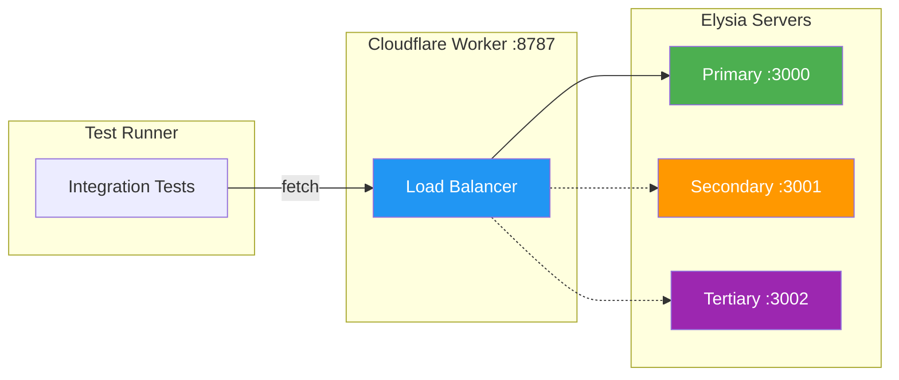

# Integration Testing

This directory contains a complete integration testing setup for the load balancer package using:

- **Elysia backend servers** - Simulates real REST API backends
- **Cloudflare Worker** (via Wrangler) - Runs the load balancer locally
- **Test runner** - Verifies full client consumption flow

## Architecture



## Quick Start

**Terminal 1: Start Backend Servers**
```bash
bun run integration:backends
```

**Terminal 2: Start Worker**
```bash
bun run integration:worker
```

**Terminal 3: Run Tests**
```bash
bun run integration:test
```

## What Gets Tested

### REST API Methods
| Method | Endpoint | Test |
|--------|----------|------|
| GET | `/users` | List all users |
| GET | `/users/:id` | Get user by ID |
| GET | `/users/:id` (404) | Not found handling |
| POST | `/users` | Create new user |
| PUT | `/users/:id` | Update user |
| DELETE | `/users/:id` | Delete user |
| GET | `/products` | List products |
| GET | `/products/:id` | Get product by ID |
| POST | `/orders` | Create order |
| POST | `/api/echo` | Echo request body |

### Load Balancer Features
| Test | Description |
|------|-------------|
| Headers present | `X-Load-Balancer-Endpoint` and `X-Load-Balancer-Latency` |
| Health check | `/health` endpoint proxied correctly |
| Concurrent requests | 10 simultaneous GET requests |
| Mixed methods | Concurrent GET/POST/PUT/DELETE |
| Error handling | Backend 500 errors proxied |
| Authorization | Bearer tokens forwarded |
| Custom headers | `X-Custom-Header` forwarded |
| Query params | `?page=1&limit=10` preserved |

## Backend Endpoints

The Elysia servers expose a full REST API:

```
GET    /              - Server info
GET    /health        - Health check

GET    /users         - List all users
GET    /users/:id     - Get user by ID
POST   /users         - Create user (body: {name, email})
PUT    /users/:id     - Update user (body: {name?, email?})
DELETE /users/:id     - Delete user

GET    /products      - List all products
GET    /products/:id  - Get product by ID

GET    /orders        - List all orders
POST   /orders        - Create order (body: {userId, productId})

POST   /api/echo      - Echo request body + headers
GET    /api/data      - Sample API response
GET    /slow          - Delayed response (5s)
GET    /error         - Returns 500 error
```

## Test Output Example

```
╔════════════════════════════════════════════════════════════╗
║       Load Balancer Integration Test Suite                 ║
╚════════════════════════════════════════════════════════════╝

🔍 Checking backend servers...
  ✅ primary is healthy
  ✅ secondary is healthy
  ✅ tertiary is healthy

🔍 Checking Worker...
  ✅ Worker is running at http://localhost:8787

📋 Running GET Tests...
  ✅ GET /users - List all users (5ms)
  ✅ GET /users/:id - Get user by ID (3ms)
  ✅ GET /users/:id - Not found returns 404 (3ms)
  ✅ GET /products - List all products (2ms)
  ✅ GET /products/:id - Get product by ID (2ms)

📋 Running POST Tests...
  ✅ POST /users - Create new user (15ms)
  ✅ POST /orders - Create new order (8ms)
  ✅ POST /api/echo - Echo request body (4ms)

📋 Running PUT Tests...
  ✅ PUT /users/:id - Update user (5ms)

📋 Running DELETE Tests...
  ✅ DELETE /users/:id - Delete user (4ms)

📋 Running Load Balancer Tests...
  ✅ Load balancer headers present (2ms)
  ✅ Health endpoint proxied correctly (2ms)

📋 Running Concurrent Request Tests...
  ✅ 10 concurrent GET requests (13ms)
  ✅ Concurrent mixed method requests (12ms)

📋 Running Error Handling Tests...
  ✅ Backend 500 error proxied (3ms)

📋 Running Header Forwarding Tests...
  ✅ Authorization header forwarded (4ms)
  ✅ Custom headers forwarded (4ms)

📋 Running Query Parameter Tests...
  ✅ Query parameters preserved (3ms)

╔════════════════════════════════════════════════════════════╗
║                        Test Summary                        ║
╚════════════════════════════════════════════════════════════╝

  Total:  18 tests
  Passed: 18 ✅
  Failed: 0 ❌
  Time:   92ms

  🎉 All tests passed!
```

## Files

| File | Description |
|------|-------------|
| `backends.ts` | Elysia REST API servers (ports 3000, 3001, 3002) |
| `worker.ts` | Load balancer Worker configuration |
| `wrangler.toml` | Wrangler configuration |
| `test-runner.ts` | Integration test suite |
